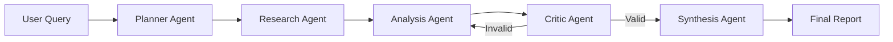

# 🔮 Autonomous Market Research Agent

<p align="center">
  <a href="https://www.python.org/"></a>
  <a href="https://groq.com/"></a>
  <a href="https://www.langchain.com/"></a>
  <a href="https://github.com/langchain-ai/langgraph"></a>
  <a href="https://www.gradio.app/"></a>
  <a href="https://python-dotenv.readthedocs.io/"></a>
  
  
</p>

<p align="center">
  An autonomous AI agent that conducts end-to-end market research with minimal human intervention. Built with Groq (Llama), LangGraph, and a beautiful glassmorphism UI.
</p>

---

## 🎯 What is This?

Unlike traditional chatbots that only answer direct questions, this **Agentic AI system** can:

- 🧠 **Autonomously plan** research strategies
- 🔍 **Break down** complex queries into actionable sub-tasks
- 📊 **Gather and analyze** information systematically
- ✅ **Self-validate** outputs for quality assurance
- 📄 **Generate** structured, decision-ready reports

Think of it as having a **junior analyst on demand** that works 24/7.

---

## ✨ Features

### 🤖 Agentic AI Capabilities
- **Autonomous Planning** - Decomposes research questions without human guidance
- **Multi-Step Reasoning** - Sequential workflow with 5 specialized agents
- **Tool Usage** - Simulates web search and data gathering
- **Self-Correction** - Re-analyzes if quality validation fails
- **Goal-Driven Execution** - Stays focused on delivering actionable insights

### 🎨 User Interface
- **Glassmorphism Design** - Apple-inspired minimal aesthetic
- **Real-time Progress** - Watch the agent work through each phase
- **Mobile Responsive** - Works on any device
- **Copy-Paste Friendly** - Clean markdown reports
- **Secure API Key Input** - Never stored or logged

---

## 🛠️ Technology Stack

<p align="center">
  <a href="https://www.python.org/"></a>
  <a href="https://groq.com/"></a>
  <a href="https://www.langchain.com/"></a>
  <a href="https://github.com/langchain-ai/langgraph"></a>
  <a href="https://www.gradio.app/"></a>
  <a href="https://python-dotenv.readthedocs.io/"></a>
</p>

### Core Components

| Component | Purpose |
|-----------|---------|
| **Groq (Llama-3.3-70B)** | Ultra-fast LLM inference engine |
| **LangGraph** | Agent workflow orchestration & state management |
| **LangChain** | LLM framework & prompt templates |
| **Gradio** | Web UI with minimal glassmorphism design |
| **Python 3.8+** | Core programming language |

---

## 🚀 Quick Start

### Prerequisites

- Python 3.8 or higher
- Groq API key (free at [console.groq.com](https://console.groq.com))

### Installation

1. **Clone the repository**
```bash
git clone https://github.com/yourusername/autonomous-research-agent.git
cd autonomous-research-agent
```

2. **Install dependencies**
```bash
pip install -r requirements.txt
```

3. **Set up environment (Optional)**
```bash
# Create .env file
echo "GROQ_API_KEY=your_key_here" > .env
```

4. **Run the agent**
```bash
python market_research_agent.py
```

5. **Open your browser**
```
http://localhost:7860
```

---

## 📦 Dependencies

Create a `requirements.txt` file:

```txt
langgraph>=0.0.20
langchain-groq>=0.1.0
langchain-core>=0.1.0
python-dotenv>=1.0.0
gradio>=4.0.0
```

Install all at once:
```bash
pip install -r requirements.txt
```

---

## 🎯 Usage Examples

### Example 1: Technology Comparison
```
Query: "Compare LangGraph vs AutoGen adoption in 2025"

Output: Comprehensive report with:
- Feature comparison
- Adoption trends
- Use case recommendations
- Pros and cons analysis
```

### Example 2: Market Analysis
```
Query: "What are the best AI video generation tools in 2025?"

Output: Executive summary with:
- Top tools and their features
- Pricing comparison
- Target audience analysis
- Recommendation for different use cases
```

### Example 3: Competitive Intelligence
```
Query: "Analyze the feasibility of AI coding assistants for enterprises"

Output: Strategic report including:
- Market overview
- ROI analysis
- Implementation challenges
- Vendor comparison
```

---

## 🤖 How It Works

The agent follows a **5-phase workflow**:



### Phase Breakdown

| Phase | Agent | Function |
|-------|-------|----------|
| 1️⃣ | **Planner** | Decomposes query into 4-6 sub-questions |
| 2️⃣ | **Researcher** | Gathers information for each sub-question |
| 3️⃣ | **Analyst** | Identifies patterns, trends, and insights |
| 4️⃣ | **Critic** | Validates quality and checks for bias |
| 5️⃣ | **Synthesizer** | Creates executive summary & recommendations |

---

## 🎨 UI Preview

The interface features a **minimal Apple-inspired design** with:

- 🪟 Glassmorphism effects
- 🌈 Smooth gradient backgrounds
- ✨ Subtle animations
- 📱 Mobile responsive layout
- 🎯 Clear visual hierarchy

---

## ⚙️ Configuration

### Model Settings

You can adjust the LLM parameters in the code:

```python
llm = ChatGroq(
    model="llama-3.3-70b-versatile",  # Model selection
    temperature=0.3,                   # Creativity (0-1)
    max_tokens=2048                    # Response length
)
```

### Available Models
- `llama-3.3-70b-versatile` (Default - Best balance)
- `llama-3.1-70b-versatile` (Fast)
- `mixtral-8x7b-32768` (Long context)

---

## 📊 Use Cases

### 🏢 Enterprise
- Competitive analysis
- Market research reports
- Technology evaluation
- Vendor comparison
- Strategic planning

### 🚀 Startups
- Product-market fit research
- Technology stack selection
- Trend analysis
- Feasibility studies
- Investor research

### 📚 Research
- Literature review assistance
- Trend identification
- Comparative studies
- Data synthesis
- Hypothesis generation

### 💼 Consulting
- Client research
- Industry analysis
- Due diligence
- Market sizing
- Opportunity assessment

---

## 🔒 Security & Privacy

- ✅ API keys are **never stored** or logged
- ✅ All processing happens in **real-time**
- ✅ No data persistence or tracking
- ✅ Runs **locally** on your machine
- ✅ Open source - audit the code yourself

---

## 🚧 Roadmap

### Planned Features
- [ ] Real web search integration (Tavily, SerpAPI)
- [ ] PDF/Markdown export functionality
- [ ] Multi-language support
- [ ] Batch processing for multiple queries
- [ ] Memory system for context retention
- [ ] Data visualization (charts, graphs)
- [ ] Source citation tracking
- [ ] Collaborative research mode

---

## 🤝 Contributing

Contributions are welcome! Here's how:

1. Fork the repository
2. Create your feature branch (`git checkout -b feature/AmazingFeature`)
3. Commit your changes (`git commit -m 'Add some AmazingFeature'`)
4. Push to the branch (`git push origin feature/AmazingFeature`)
5. Open a Pull Request

---

## 🙏 Acknowledgments

- **Groq** - For providing ultra-fast LLM inference
- **LangChain Team** - For the amazing agent framework
- **Anthropic** - For Claude's assistance in building this
- **Gradio** - For the beautiful UI framework

---

## 📧 Contact

Have questions or suggestions? 

- 📧 Email: harshitwaldia112@gmail.com
- 🐦 Twitter: [@HarshitWaldia](https://x.com/HarshitWaldia)
- 💼 LinkedIn: [Harshit Waldia](https://www.linkedin.com/in/harshit-waldia/)
- ⚙️ GitHub: [@HarshitWaldia](https://github.com/HarshitWaldia)

---

## ⭐ Star History

If you find this project useful, please consider giving it a star! ⭐

---

## 👨‍💻 Author

**Harshit Waldia**


<p align="center">
  <strong>Built for researchers, by researcher</strong>
</p>
